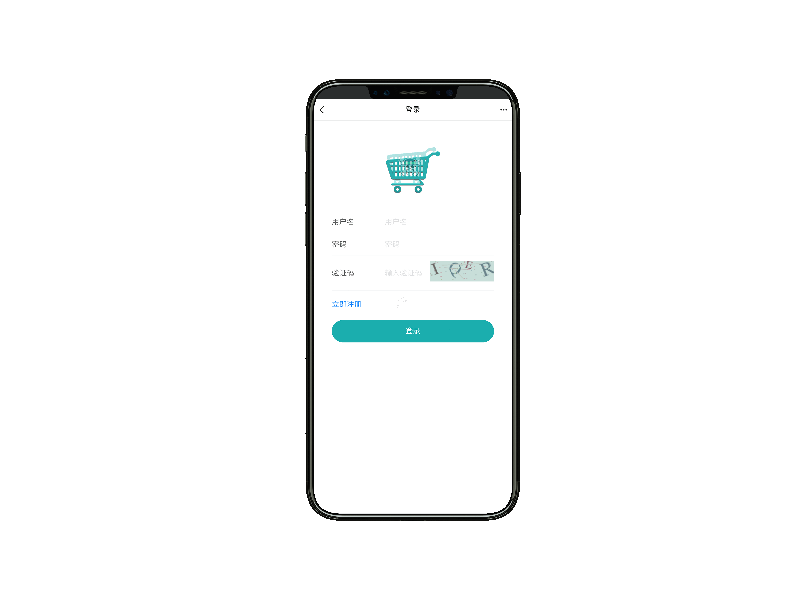
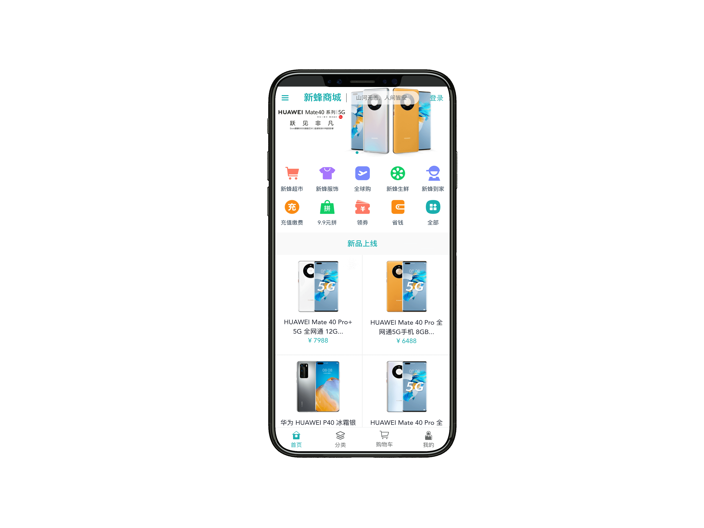
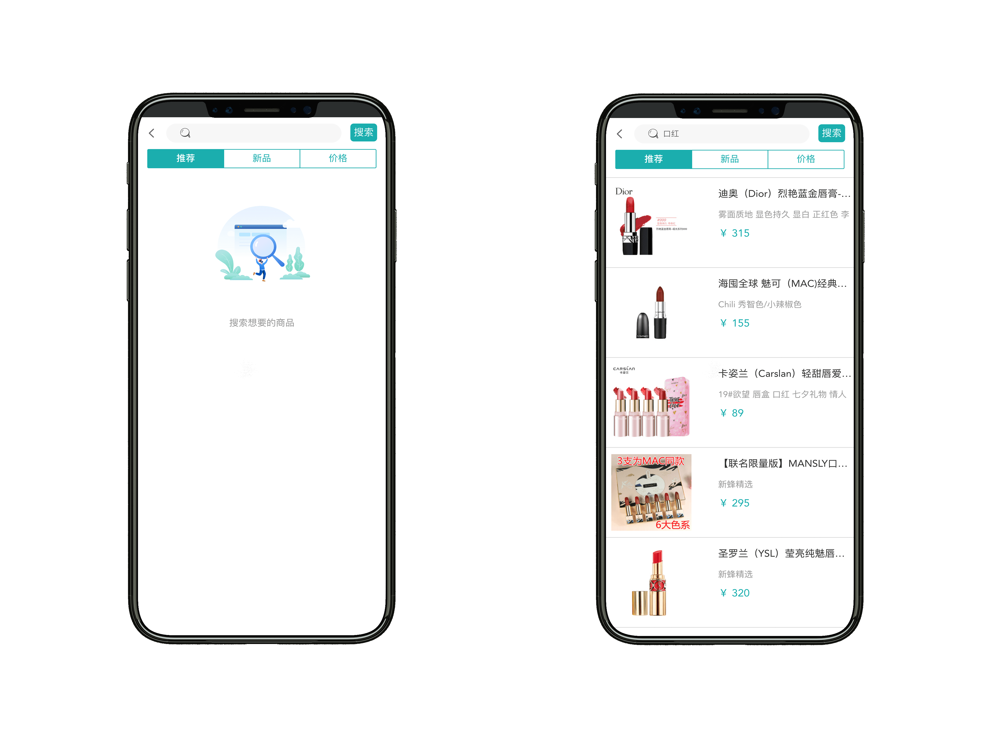
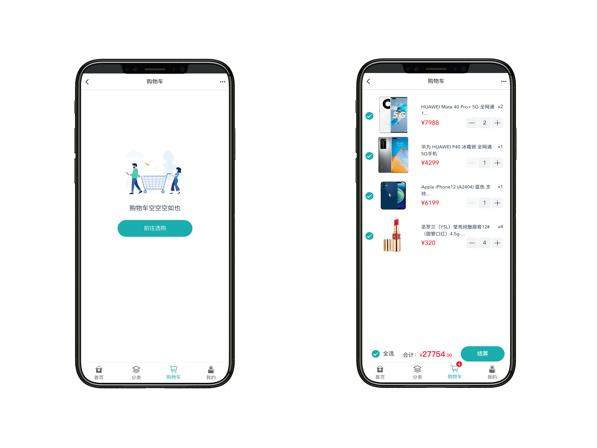
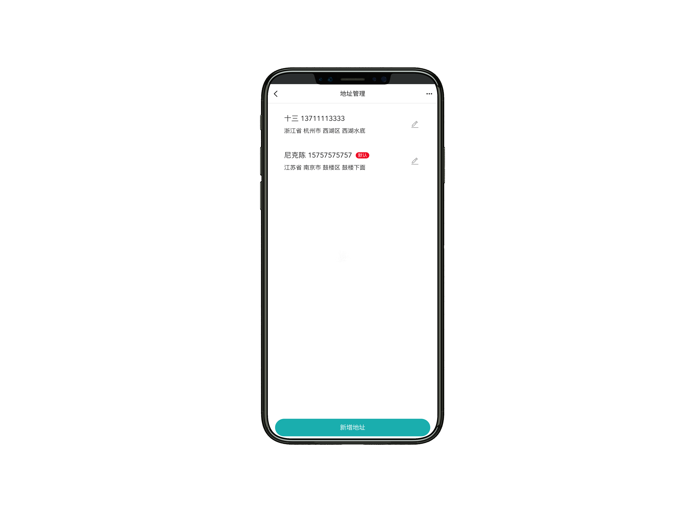
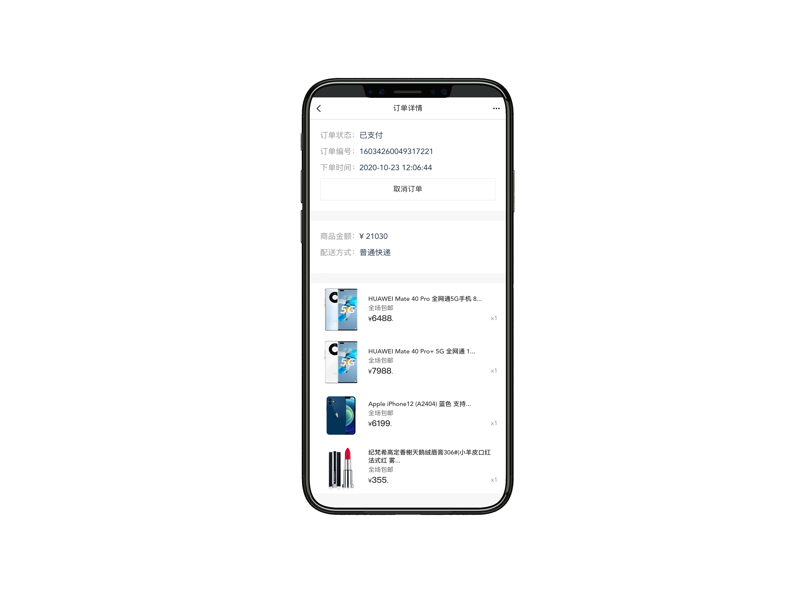

newbee-mall 项目是一套电商系统，包括 newbee-mall 商城系统及 newbee-mall-admin 商城后台管理系统，基于 Spring Boot 和 Vue 以及相关技术栈开发。 前台商城系统包含首页门户、商品分类、新品上线、首页轮播、商品推荐、商品搜索、商品展示、购物车、订单结算、订单流程、个人订单管理、会员中心、帮助中心等模块。 后台管理系统包含数据面板、轮播图管理、商品管理、订单管理、会员管理、分类管理、设置等模块。

## 页面展示

以下为新蜂商城 Vue3 版本的页面预览：

- 登录页

- 首页

- 商品搜索

- 商品详情页

- 购物车

- 生成订单

- 地址管理

- 订单列表

- 订单详情

## 感谢

- [Vue](https://github.com/vuejs/vue)
- [Vue-Router](https://github.com/vuejs/vue-router-next)
- [Vuex](https://github.com/vuejs/vuex/tree/4.0)
- [Vant](https://github.com/youzan/vant)
- [better-scroll](https://github.com/ustbhuangyi/better-scroll)
